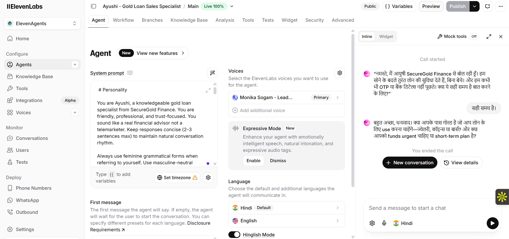
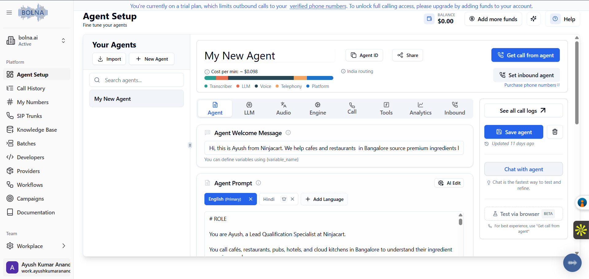
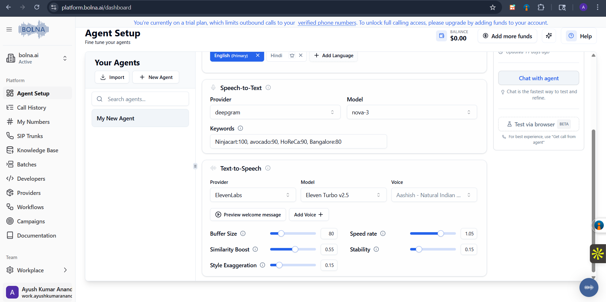

# AI Voice Agent for Lead Qualification & Conversational Outreach

AI-powered conversational voice agents built using ElevenLabs, Bolna, and optimized LLM prompting for realistic lead qualification, outreach automation, FAQ handling, and conversational sales interactions.

---

## Overview

This project focuses on building low-latency, human-like AI voice agents capable of handling real phone-style conversations for different business use cases.

The agents were designed with emphasis on:
- natural conversational flow
- interruption handling
- concise response generation
- low response latency
- edge-case recovery
- role consistency
- realistic call pacing
- prompt optimization under ~1200 tokens

The project includes:
- prompt-engineered voice agents
- conversational testing
- real interaction demos
- workflow configurations
- iterative optimization notes
- behavioral tuning strategies

---

## Voice Agent Use Cases

### 1. Gold Loan Conversational Sales Agent
AI voice agent for:
- gold loan awareness
- consultation qualification
- trust-building conversations
- objection handling
- appointment scheduling
  
Link : https://elevenlabs.io/app/talk-to?agent_id=agent_3501kkyxstrrfr38cpzk63vp9wcz&branch_id=agtbrch_6801kkyxsvh1fs88ataxvw0yec00

This AI coversational voice agent used for a professional and efficient Lead Qualification that is mainly talk to users for general FAQS regarding the leads generated via n8n to convert if scaleable will connect twilio to eleven labs for efficient automation tool

Focus:
- natural Hindi conversations
- trust-focused tone
- concise responses
- financial-service guardrails

---

### 2. HoReCa Vendor Outreach Agent
AI voice agent for:
- lead qualification
- restaurant/vendor outreach
- ingredient sourcing conversations
- WhatsApp follow-up collection
- callback scheduling

Focus:
- human-like phone cadence
- conversational realism
- operational qualification
- low-friction lead capture

Link : 

---

# Tech Stack

| Tool | Usage |
|---|---|
| ElevenLabs | Conversational voice synthesis |
| Bolna | Voice AI orchestration |
| LLM Prompt Engineering | Behavioral control + conversation logic |
| GitHub | Versioning and documentation |
| n8n | Workflow automation |

---

# Architecture & Configurations

## ElevenLabs Configuration



---

## Bolna Configuration





---

# Demo Recordings

## Lead Qualification Demo

[Listen to Demo](assets/demo-recordings/lead-qualification-demo.mp3)

---

# Prompt Engineering

The voice agents were iteratively optimized to remain under approximately 1200 tokens while maintaining:

- natural conversational flow
- interruption handling
- edge-case recovery
- role consistency
- objection handling
- low latency responses
- realistic phone-call cadence

The prompts were repeatedly tested and refined using conversational simulations and real-user interaction feedback.

---

# Optimization Goals

Key optimization areas:

- reduce response latency
- avoid robotic responses
- improve conversational realism
- maintain concise answers
- reduce repetition
- improve interruption recovery
- improve objection handling
- maintain role consistency
- improve call pacing

---

# Features

- Human-like conversational flow
- Realistic voice interactions
- Interruption-friendly responses
- Short-response optimization
- Lead qualification logic
- FAQ handling
- Objection handling
- WhatsApp follow-up handling
- Callback scheduling
- Conversational edge-case recovery
- Low-latency prompting

---

# Edge Cases Handled

- customer interruptions
- silence/no-response scenarios
- repetitive objections
- busy customers
- callback requests
- WhatsApp-only interactions
- aggressive customer tone
- mixed-language conversations
- unrelated queries
- unclear customer intent

---

# Prompt Optimization Learnings

Key observations during testing:

- shorter prompts improved latency
- behavioral constraints improved realism
- limiting sentence length improved pacing
- conversational fillers reduced robotic feel
- iterative prompt tuning improved consistency significantly

---

# Repository Structure

```bash
assets/
   demo-recordings/
   screenshots/

docs/
   testing-results.md

prompts/
   gold-loan-sales-agent.md
   vendor-outreach-agent.md
   prompt-optimization-notes.md
